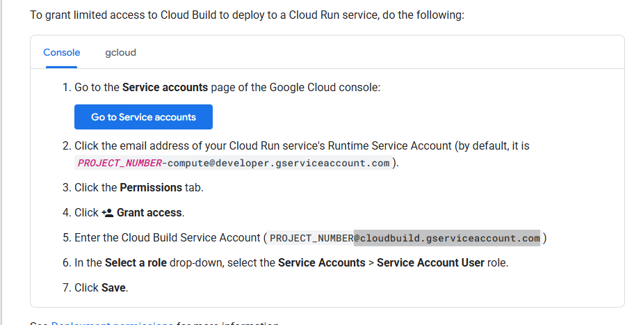

# cloud-based-speech-translator-generator

before terraform:

https://stackoverflow.com/questions/62783869/why-am-i-seeing-this-error-error-gcloud-run-deploy-permission-denied-the-c
https://cloud.google.com/build/docs/deploying-builds/deploy-cloud-run#before_you_begin

w wybieraniu principal wrzucic project number i wybrac maila z cloudbuild jakims, inny niz w tutorialu

komenda: gcloud config list
sprawdzic czy dobrze printuje wszystko co chcemy

w razie czego ustawic projekt poprawny komendą: gcloud config set project NEW_PROJECT_ID